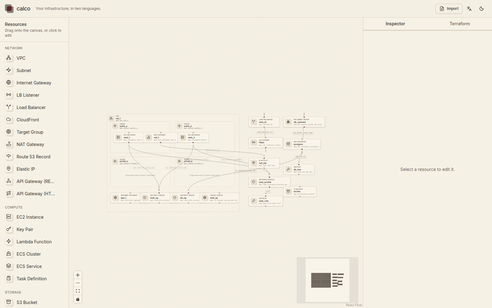
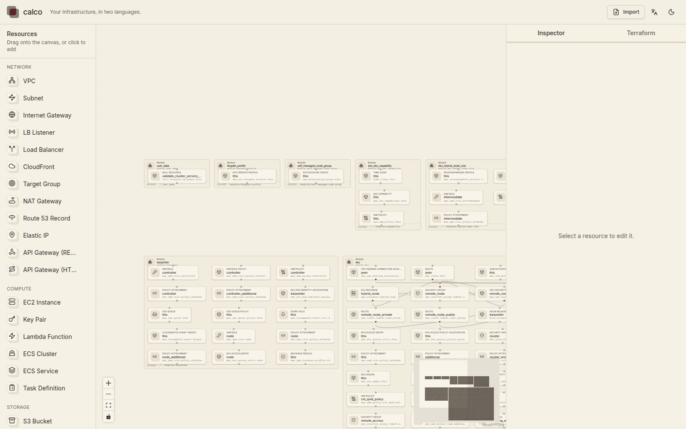
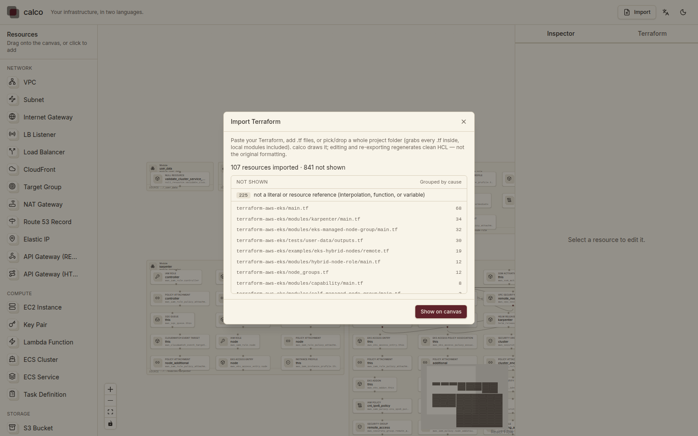

<div align="center">

<picture>
  <source media="(prefers-color-scheme: dark)" srcset="docs/brand/calco-lockup-dark.svg">
  
</picture>

*Your infrastructure, in two languages.*

[Español](README.es.md) · **English**

 

</div>

---

## About

calco is a visual tool for designing and reading cloud infrastructure on AWS. It works in two directions: drag AWS resources onto a canvas and export clean Terraform, or import an existing Terraform repository and see it drawn — dependencies, gaps, and forgotten decisions made visible. Imported module boundaries are drawn as read-only containers, so the structure of a real module-based repo is visible at a glance.

The name comes from *papel calco* — the translucent tracing paper that draftsmen used to copy or modify architectural plans. The metaphor is precise: Terraform code and the canvas diagram are tracings of one another, layers of the same reality seen from two angles. calco translates between them.

It is built for engineers who think visually but still write HCL, and for teams who inherited infrastructure from someone who left two years ago.

## Project status

**Pre-MVP, runnable in development mode.** Brand, architecture and both flows are implemented for the core path; production packaging and cloud features are pending.

What exists today:

- **Greenfield** — canvas → generate → exportable Terraform
- **Brownfield** — import a Terraform folder and see it drawn; local `module` blocks resolve as read-only containers; whatever can't be drawn becomes a grouped import report instead of a wall of errors
- **Docs** — brand system, architecture doc, 6 ADRs

## The two flows

```
GREENFIELD                              BROWNFIELD

  ┌─────────────┐                         ┌─────────────┐
  │   canvas    │                         │   *.tf      │
  │  ┌─┐ ┌─┐    │                         │  resource   │
  │  └─┘ └─┘    │  ─── translate ───►     │  aws_vpc    │
  │     ┌─┐     │                         │  aws_subnet │
  │     └─┘     │                         └──────┬──────┘
  └──────┬──────┘                                │
         │                                       ▼
         ▼                                ┌─────────────┐
  ┌─────────────┐                         │   canvas    │
  │   *.tf      │                         │  (drawn     │
  │  HCL ready  │                         │   from your │
  │  to apply   │                         │   real TF)  │
  └─────────────┘                         └─────────────┘
```

## Screenshots

| Design on a canvas                      | Import a real repo                          |
| --------------------------------------- | ------------------------------------------- |
|  |  |

The left screenshot is the built-in three-tier example on the canvas. The right one is the `terraform-aws-modules/terraform-aws-eks` root module imported as-is: 107 resources, each local `module` block drawn as a read-only container with its resources nested inside (0 overlaps, fully in view).

What can't be drawn is reported, not swallowed:



For that same EKS import, 841 constructs aren't represented on the canvas yet (`var.*` references, interpolation, data sources…). Instead of 1,609 flat diagnostics they render as **109 groups grouped by cause and file** — each group one click away from the offending file.

## Architecture

Modular monolith with hexagonal (ports & adapters) layering on the backend, feature-based organization on the frontend. The graph model is the single source of truth between canvas and code.

Full details in [`docs/ARCHITECTURE.md`](docs/ARCHITECTURE.md). Decisions and rationale in [`docs/adr/`](docs/adr/).

## Tech stack

| Layer      | Tool                                                                       |
| ---------- | -------------------------------------------------------------------------- |
| Frontend   | TypeScript, Vite, React 19, `@xyflow/react`, Tailwind v4, shadcn/ui        |
| State      | Zustand (client) + TanStack Query (server)                                 |
| Routing    | React Router 7                                                             |
| Backend    | Go 1.26, Huma v2, chi v5                                                   |
| API        | REST + OpenAPI 3.1 (auto-generated by Huma)                                |
| HCL engine | `hashicorp/hcl/v2` + `hclwrite` (in-process)                               |
| Runner     | Docker (`terraform validate`, `plan -refresh=false`, `graph`) — future     |
| Database   | sqlc + goose · pgx (Postgres, hosted) · modernc.org/sqlite (self-host)     |
| Deploy     | Docker Compose (self-host) · ECS Fargate (hosted)                          |

## Roadmap

- [x] Brand and design system (`docs/BRAND.md`)
- [x] Architecture document (`docs/ARCHITECTURE.md`) and ADRs
- [x] Repository scaffold (monorepo, lint, CI)
- [x] Graph model and HCL generator (greenfield)
- [x] Canvas with React Flow (palette → generate)
- [x] Brownfield importer (read-only visualization, local modules) — see [ADR-0006](docs/adr/0006-local-modules.md)
- [ ] Remote module resolution (GithubFetcher + runner)
- [ ] Terraform runner sandbox
- [ ] Self-hosted MVP (Docker Compose)
- [ ] Hosted version (auth, multi-tenant, AWS connect)

## Quick start

Prerequisites: **Go 1.26+**, **Node 22+** with `pnpm`, and optionally [Task](https://taskfile.dev) (`go install github.com/go-task/task/v3/cmd/task@latest`) plus [air](https://github.com/air-verse/air) for hot reload.

```bash
task dev            # web (:5173) + API (:8080), both with hot reload
# or, without Task and air:
cd apps/server && go run ./cmd/server   # API on :8080, API reference at /docs
cd apps/web   && pnpm dev               # app on :5173
```

Open http://localhost:5173 and press **Import** to load a local Terraform repository (folder picker). The importer runs entirely in-process — no Docker, no network, no `terraform init`.

| Purpose          | Command                  |
| ---------------- | ------------------------ |
| All tests        | `task test`              |
| Lint + vet       | `task lint`              |
| Build binaries   | `task build`             |
| Web tests only   | `cd apps/web && pnpm test` |
| Server tests only| `cd apps/server && go test ./...` |
| Regenerate TS types | `cd apps/web && pnpm gen:types` (against a running server) |

## Repository structure

```
calco/
├── apps/
│   ├── server/                     # Go API (hexagonal, in-process HCL engine)
│   │   ├── cmd/server/             # entry point and manual DI
│   │   └── internal/               # config, domain, application, adapters
│   └── web/                        # React frontend (feature-based)
│       └── src/features/           # canvas, generate, import, catalog…
├── docs/
│   ├── adr/                        # architecture decision records
│   │   ├── 0001-architecture-pattern.md
│   │   ├── 0002-backend-language.md
│   │   ├── 0003-api-and-web-framework.md
│   │   ├── 0004-data-layer.md
│   │   ├── 0005-nested-blocks.md
│   │   └── 0006-local-modules.md
│   ├── brand/                      # logo assets + preview
│   ├── screenshots/                # screenshots used in this README
│   ├── ARCHITECTURE.md
│   └── BRAND.md
├── Taskfile.yml                    # task dev / build / test / lint
├── LICENSE
├── README.md
└── README.es.md
```

## Documentation

- [`docs/ARCHITECTURE.md`](docs/ARCHITECTURE.md) — system architecture, layers, flows
- [`docs/BRAND.md`](docs/BRAND.md) — brand identity and design system
- [`docs/adr/`](docs/adr/) — architecture decision records (6 so far)

## License

Apache 2.0. See [LICENSE](LICENSE).

The open-source core lives in this repository. Commercial features — managed hosting, multi-tenancy, AWS account integration, support — live in a separate private repository and are not covered by this license.

## Author

Built by [Joshua Franco](https://github.com/JoshF8).